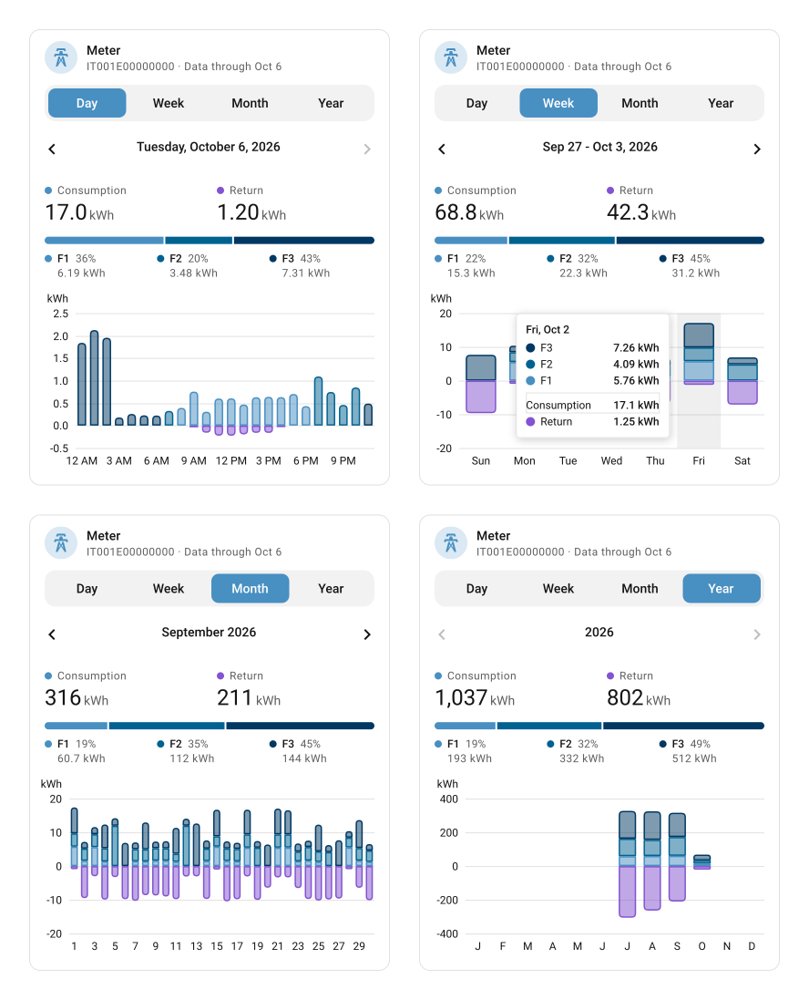

# HomeAssistant-EDistribuzione

Custom Home Assistant integration for **E-Distribuzione**, the main Italian
electricity distribution network operator.

For every configured **POD** it imports both energy directions as external
statistics, ready for the Energy Dashboard:

- **Consumption** - energy drawn from the grid
- **Injection** - energy returned to the grid, including solar production

Each POD has a configurable role:

- **Regular / exchange meter** - the main electricity meter
- **Solar / production meter** - a meter dedicated to photovoltaic production

The role only changes how entities and statistics are named. **Both
directions are always downloaded for every POD**, whatever its role.

## Installation

### Requirements

- **Home Assistant 2025.4** or later, with [HACS](https://hacs.xyz)
  installed
- The **email and password** of your E-Distribuzione customer area
- Access to the email address or phone number where the OTP code arrives

> [!IMPORTANT]
> Log out of the official E-Distribuzione app and website before setting up
> the integration. E-Distribuzione limits the number of concurrent sessions
> per account, and with too many open it sends no OTP code.

### Install with HACS

The integration is not in the default HACS store: add it as a custom
repository.

1. Open **HACS**, then **⋮ → Custom repositories**.
2. Add `https://github.com/fabioscarparo/HomeAssistant-EDistribuzione` with
   type **Integration**.
3. Search for **E-Distribuzione**, open it and select **Download**. The
   repository publishes no releases, so HACS installs the latest commit.
4. Restart Home Assistant: **Settings → System**, power icon (top right) →
   **Restart Home Assistant**. You can also use the **Restart required**
   notice in **Settings → Repairs**.

### Manual installation

Copy `custom_components/edistribuzione/` into the `custom_components/`
folder of your Home Assistant configuration, then restart Home Assistant.

### Migrating from maurobraggio's repository

If you are coming from
[maurobraggio/HomeAssistant-EDistribuzione](https://github.com/maurobraggio/HomeAssistant-EDistribuzione):

1. Remove **only the repository** from HACS.
2. Do **not** remove the integration from **Settings → Devices & services**.
3. Add this repository following the steps above.

The integration domain is the same, so the existing setup and data are
kept.

## Setup

### 1. Add the integration

1. Go to **Settings → Devices & services → Add integration** and search for
   **E-Distribuzione**. If it does not appear, reload the page.
2. Enter the email and password of your customer area.
3. Enter the OTP code you receive by email or SMS.

> [!NOTE]
> Only use the code that arrives after submitting your credentials here.
> Codes generated in the E-Distribuzione app or on the website belong to a
> different login session and are always rejected.

- **No OTP code?** Tick **Request a new code**, leave the code field empty
  and submit the form.
- **Too many concurrent sessions?** Log out of the official app and website,
  wait a few minutes and try again.

### 2. Select the PODs

If the account has more than one POD, choose the ones to monitor. With a
single POD this step is skipped.

### 3. Configure the POD role

Only needed with separate exchange and production meters, for example a
solar system with two meters. Go to **Settings → Devices & services →
E-Distribuzione → Configure → Meter type per POD** and set the production
meter to **Solar / production meter**.

With an exchange meter only there is nothing to change. The role can be
changed at any time and does not affect which data is downloaded.

## Fetching historical data

History is not downloaded automatically: right after setup the integration
imports only the **last 3 days**, to check that the POD and the login work.
Use the **Fetch history** action to import older data.

### Fetch history from the UI

1. Go to **Developer tools → Actions** and choose **E-Distribuzione: Fetch
   history**.
2. Fill in the fields:
   - **Setup / POD**: the **E-Distribuzione** device fetches all configured
     PODs; a single POD's device limits the fetch to that POD.
   - **Start date** and **End date**: the end date can be **yesterday at
     the latest**.
3. Select **Perform action** and wait: six months of data can take a few
   tens of seconds.

### Import range

Each run covers up to about six months: **181 days** is the longest range
confirmed to work in a single response. For a longer history, run the
action over consecutive periods.

Running it again over a period that was already imported is always safe:
samples are updated instead of duplicated, corrections published by
E-Distribuzione are applied, and the hourly values and cumulative
statistics are rebuilt consistently.

### YAML

```yaml
action: edistribuzione.recupera_storico
data:
  device_id: 4f1c9e0a7b2d4c3e8a6f5b1d2c3e4f50
  data_da: "2026-04-10"
  data_a: "2026-10-07"
```

### Finding the `device_id`

Go to **Developer tools → Template** and paste:

```jinja

{{ device_attr(d, 'name') }}: {{ d }}

```

It prints one line per device:

```text
E-Distribuzione: 4f1c9e0a7b2d4c3e8a6f5b1d2c3e4f50
POD IT001E12345678: 9a8b7c6d5e4f3a2b1c0d9e8f7a6b5c4d
```

In a browser you can also open the device page: the ID is the last part of
the address, after `/config/devices/device/`.

If the template prints nothing, the integration is not set up yet, or Home
Assistant was not restarted after installing it.

## Checking the imported history

### Action result

A green check on the button means that at least one POD received data. A
red message means that nothing was imported, and says why:

- no data available for the requested period;
- end date too recent;
- start date after the end date;
- requested range too long.

### POD card and Energy Dashboard

In the [POD card](#pod-lovelace-card), switch to the **Month** or **Year**
view and go back with **‹**: navigation stops at the first period with
data. In the Energy Dashboard you can also pick a past period directly.

### Number of days received

The number of days received is logged at info level:

1. **Settings → Devices & services → E-Distribuzione → ⋮ → Enable debug
   logging**.
2. Run the history action again.
3. In **Settings → System → Logs**, switch to the raw logs from the **⋮**
   menu and search for `recupero storico`. Log messages are in Italian:

   ```text
   POD IT001E12345678: recupero storico 2026-04-10 - 2026-10-07 completato, 181/181 giorni ricevuti (unione delle due direzioni)
   ```

   Missing days, if any, are listed in brackets at the end of the line.
4. Select **Disable debug logging** when you are done.

> [!NOTE]
> **Last available date** is not a reliable check for a history import: it
> shows the most recent day, which was usually there already, and updates
> on the next hourly cycle.

With several PODs the action succeeds as long as at least one of them
received data. PODs that failed show up as warnings in **Settings → System
→ Logs**, even without debug logging.

## Daily updates

E-Distribuzione publishes data with a **one-day delay**. Every day from
**19:00** the integration requests the previous days, always rechecking the
last **3 days** so that later corrections are imported automatically. You
can change the hour in **Configure → Request time**.

To check that it is working, open the POD device: the diagnostic sensors
show the most recent imported day and its values.

| Meter role | Diagnostic sensors |
|---|---|
| Exchange | Last available date, Last day consumption, Last day return to grid |
| Production | Last available date, Last day production, Last day consumption (technical) |

## Energy Dashboard

### Automatic configuration

Run **E-Distribuzione: Configure Energy Dashboard**
(`edistribuzione.configura_energy_dashboard`) from **Developer tools →
Actions**. It adds the statistics of every configured POD according to its
role, and never overwrites or duplicates sources that already exist,
including those added by hand. You can run it again after adding a POD or
changing a role.

> [!WARNING]
> The action only knows the total consumption series. If you replaced the
> total with the [F1/F2/F3 bands](#f1--f2--f3-time-bands), do not run it
> again: it would add the total back and consumption would be counted
> twice.

### Manual configuration

Go to **Settings → Dashboards → Energy**. For a system with an exchange
meter (M1) and a production meter (M2):

| Energy Dashboard section | Statistic |
|---|---|
| Electricity grid → Grid consumption | `edistribuzione:<pod_m1>_energia` |
| Electricity grid → Return to grid | `edistribuzione:<pod_m1>_energia_immessa` |
| Solar panels → Solar production | `edistribuzione:<pod_m2>_energia_immessa` |

`edistribuzione:<pod_m2>_energia` is the consumption of the production
meter itself, typically the inverter's standby draw, a few tenths of a kWh
per month. It stays available but does not belong in any dashboard section.

Self-consumption and total home consumption are calculated by Home
Assistant from production, injection and grid consumption: no extra sensors
are needed.

## F1 / F2 / F3 time bands

For the **consumption** direction the integration also writes three
statistics, one per ARERA time band, calculated from the same 15-minute
samples as the total:

| Statistic | Time band |
|---|---|
| `edistribuzione:<pod>_energia_f1` | Monday-Friday 08:00-19:00 |
| `edistribuzione:<pod>_energia_f2` | Monday-Friday 07:00-08:00 and 19:00-23:00, Saturday 07:00-23:00 |
| `edistribuzione:<pod>_energia_f3` | Monday-Saturday 23:00-07:00, Sundays and national holidays all day |

The three series share the hourly timestamps of the total series, and hour
by hour F1 + F2 + F3 = total. Like the total, they are recalculated from
`edistribuzione_curve.db`: on the first import after updating the
integration they already cover all the history downloaded so far, and they
follow corrections on their own.

### Time zone and holidays

Classification always uses Italian time (`Europe/Rome`), whatever time zone
Home Assistant is configured with. Holidays are the 11 traditional national
ones (Easter Monday included, local patron saints excluded) plus October 4
from 2026 on (Law 151/2025). If the official October 2027 readings say
otherwise, set `SAN_FRANCESCO_FESTIVO = False` in `fasce.py`.

### Chart by time band

```yaml
type: statistics-graph
title: Consumption by time band
chart_type: bar
period: day
days_to_show: 30
stat_types:
  - change
entities:
  - edistribuzione:<pod>_energia_f1
  - edistribuzione:<pod>_energia_f2
  - edistribuzione:<pod>_energia_f3
```

### F1/F2/F3 in the Energy Dashboard

Instead of the total consumption you can add the three bands as three
separate grid consumption sources, each with its own price.

> [!IMPORTANT]
> Never add the total *and* the bands together, or consumption is counted
> twice. For the same reason, do not run **Configure Energy Dashboard**
> after switching to the bands: it adds the total only.

## POD Lovelace card

The integration ships a Lovelace card (`custom:edistribuzione-pod-card`)
built to look and behave like Home Assistant's own cards. It registers
itself: no Lovelace resource to add by hand, no second HACS repository. It
appears in the card picker as **E-Distribuzione · POD** and has a visual
editor.

<picture>
  <source media="(prefers-color-scheme: dark)" srcset="docs/images/pod-card-dark.svg">
  
</picture>

### Adding the card

1. Open a dashboard and select **Edit dashboard** (pencil).
2. Select **Add card** and search for **E-Distribuzione · POD**.
3. Add and save the card. With no options it shows the first POD found.

### If the card shows an error

Right after installing or updating the integration, the companion app can
keep showing the frontend from its cache: the card is missing from the
picker, or the dashboard shows an error such as *Custom element doesn't
exist: edistribuzione-pod-card*. Reset the app's frontend cache, then
reopen the app:

- **Android:** **Settings → Companion app → Troubleshooting → Reset
  frontend cache**
- **iOS:** **Settings → Companion app → Debugging → Clear web view cache**

In a browser, a hard reload is enough: **Ctrl+Shift+R**, or
**Cmd+Shift+R** on macOS.

### Configuration

```yaml
type: custom:edistribuzione-pod-card
pod: it001e12345678     # optional: defaults to the first POD found
name: Meter             # optional
icon: mdi:transmission-tower
period: month           # day | week | month | year
show_injection: true
```

### Features

The card shows the period's consumption and injection, the F1/F2/F3 split
and a stacked bar chart by time band:

| View | Bars |
|---|---|
| Day | Hours |
| Week | Days |
| Month | Days |
| Year | Months |

Navigation is limited to the periods that have data. The card only uses
Home Assistant theme tokens (energy colors, typography, radii, tile icon,
control select, chart theme), so it follows light/dark mode and custom
themes, as well as the language, number format, time format and first day
of the week set in the user profile.

## Languages

The integration speaks Italian and English. Entity names, setup and options
dialogs, actions and error messages follow the language of each user's
profile, with English for any other language.

Home Assistant has no translation mechanism for device models and external
statistic names, so those follow the server language (**Settings → System
→ General**): after a change, device models update on the next restart and
statistic names on the next import.

## Architecture

### 15-minute data as the source of truth

The 15-minute samples returned by E-Distribuzione (96 per day) are not
aggregated and thrown away: they first go into the integration's own SQLite
database, `edistribuzione_curve.db`, in the Home Assistant configuration
folder and separate from the Recorder database. The hourly buckets, the
cumulative sums for the Energy Dashboard and the F1/F2/F3 series are then
recalculated from the samples actually stored:

```text
E-Distribuzione API (15')
        ↓
raw storage (upsert)
        ↓
hourly buckets + cumulative sums
        ↓
Energy Dashboard
```

### Idempotent and self-correcting imports

E-Distribuzione sometimes corrects samples that were already downloaded. A
new `recupera_storico` over the same period overwrites those samples
(same POD, same direction, same instant) instead of duplicating them, then
recalculates the affected hour and all the following cumulative sums. The
final result does not depend on the order in which history, retries and
corrections arrived.

For the same reason the daily cycle does not request only the previous day:
it always rechecks the last `GIORNI_RICONTROLLO` days (3 by default, in a
single request per direction), so recent corrections are picked up without
running `recupera_storico` by hand.

## Verifying the protocol

Before trusting the data, you can check the login and data protocol with:

```bash
pip install -r requirements_test.txt
python scripts/verify_login.py
```

The script logs in (email, password and OTP), lists the account's PODs and
probes several `magnitude` candidates on the data endpoint, comparing the
totals to find out which one returns injected energy. If a candidate turns
out to be correct, update **only** `MAGNITUDE_IMMESSA` in
`custom_components/edistribuzione/const.py`.

## Development

```bash
python3 -m venv .venv
.venv/bin/pip install -r requirements_test.txt ruff
.venv/bin/python -m pytest
.venv/bin/ruff check custom_components/ tests/ scripts/
```

## Origin

This is a fork of
[maurobraggio/HomeAssistant-EDistribuzione](https://github.com/maurobraggio/HomeAssistant-EDistribuzione)
that adds the F1/F2/F3 time bands, the POD card and the English
translation.

The protocol (OAuth2 + PKCE + OTP login via Salesforce, MuleSoft REST
client for the data) was reverse-engineered for the multi-distributor
integration
[HomeAssistant-Contatore](https://github.com/riccardorossi92/HomeAssistant-Contatore),
which remains the right choice if you also deal with Duereti, Unareti or
Areti. This repository is dedicated to E-Distribuzione only, with native
support for separate consumption/injection and a configurable role per POD.
